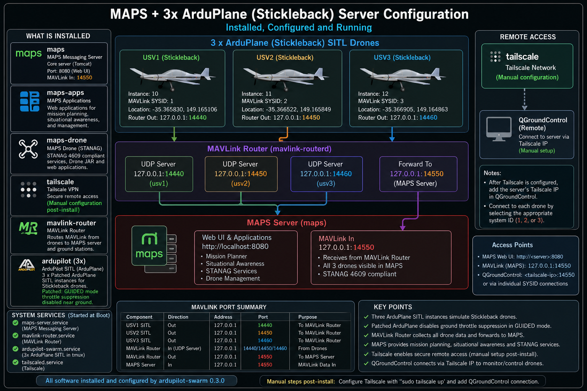

# ArduPilot Fixed-Wing Swarm Host Stack

This repository packages and installs the complete host-side stack for a three-vehicle ArduPlane SITL deployment that mirrors the Stickleback fixed-wing autopilot setup as closely as practical on a server.

It installs and configures:

- `maps` — Maps Messaging server
- `maps-apps` — Maps web and application bundle
- `maps-drone` — drone and STANAG services and web applications
- `tailscale` — installed and started, with manual post-install authentication
- `mavlink-router` — built from source and configured for the three local drones
- `ardupilot` — ArduPlane SITL, patched for GUIDED mode throttle behaviour and configured for three Stickleback simulation instances

The deployment keeps the supplied external ArduPilot parameter file unchanged and applies it to all three simulated vehicles.

## Architecture diagram



The diagram shows what the installer puts on the host, which services start automatically, how the MAVLink Router is wired, and where the remaining manual steps belong.

## What gets installed

### Application and service stack

| Component | Purpose | Installed by this project | Startup behaviour |
|---|---|---|---|
| `maps` | Core Maps Messaging server | Yes | enabled and started |
| `maps-apps` | Maps applications and web UI bundle | Yes | installed as package content used by Maps |
| `maps-drone` | Drone / STANAG services and web applications | Yes | installed as package content used by Maps |
| `tailscale` | Remote-access overlay network | Yes | `tailscaled.service` enabled and started |
| `mavlink-router` | MAVLink stream routing | Built from source | `mavlink-router.service` enabled and started |
| `ardupilot-swarm` | Three ArduPlane SITL wrappers and systemd unit | Yes | `ardupilot-swarm.service` enabled; started once parameters are present |
| `ardupilot` | ArduPlane SITL binaries | Built from source | launched by `ardupilot-swarm.service` |

### Simulated vehicles

| tmux window | SITL instance | MAVLink system ID | Router input port |
|---|---:|---:|---:|
| `usv1` | 10 | 1 | 14440 |
| `usv2` | 11 | 2 | 14450 |
| `usv3` | 12 | 3 | 14460 |

Each vehicle starts as:

```text
-v ArduPlane -f plane
```

No alternate simulation model is selected.

## MAVLink routing

The current routing model is:

- `usv1` sends MAVLink to `127.0.0.1:14440`
- `usv2` sends MAVLink to `127.0.0.1:14450`
- `usv3` sends MAVLink to `127.0.0.1:14460`
- `mavlink-router` listens on those three local UDP server endpoints
- `mavlink-router` forwards the combined stream to the Maps server on `127.0.0.1:14550`
- a separate manually configured endpoint can forward data to QGroundControl, for example to a Tailscale IP later

So:

- ports `14440`, `14450`, and `14460` are **router inputs from the drones**
- port `14550` is the **Maps MAVLink input**
- the remote QGroundControl endpoint is **not hard-coded** and is intended to be added manually after Tailscale is configured

## Managed ArduPilot patch

ArduPlane normally suppresses throttle while it believes a fixed-wing aircraft is still on the ground. That behaviour is a poor match for the Stickleback-style guided operation being simulated here, because the virtual craft can remain near home altitude and below the normal launch threshold.

This repository includes a managed patch:

```text
patches/ardupilot/0001-allow-guided-throttle-before-takeoff.patch
```

The installer:

1. checks the patch applies cleanly
2. applies it before the ArduPlane build
3. builds SITL ArduPlane
4. reverses the patch after the build so the upstream checkout stays clean

The patch only changes GUIDED-mode throttle suppression. It does not change the parameter file, flight mode selection, or other general failsafes.

## Parameter file

The deployment-specific parameter file is **not** stored in this repository and is **not** changed by the installer.

Install it separately with:

```bash
sudo ardupilot-swarm-install-parameters /path/to/drone.parm
```

Installed location:

```text
/etc/ardupilot-swarm/drone.parm
```

The start script passes the same file to all three SITL instances with `--add-param-file`.

## Services started at boot

The installed host is intended to come up automatically.

### Explicitly enabled by this installer

- `maps.service`
- `tailscaled.service`
- `mavlink-router.service`
- `ardupilot-swarm.service`

### Startup relationship

- `maps.service` provides the Maps server
- `mavlink-router.service` starts independently and is also a dependency of `ardupilot-swarm.service`
- `ardupilot-swarm.service` launches the three ArduPlane instances into tmux after the router is available
- `tailscaled.service` starts, but tailnet authentication remains manual until the operator runs `sudo tailscale up`

## Installation flow

Install the package from the configured APT repository:

```bash
sudo apt-get update
sudo apt-get install ardupilot-swarm
```

Run the installer as the account that will own the source trees and tmux session:

```bash
ardupilot-swarm-install
```

The installer performs the following major steps:

1. installs build prerequisites
2. installs and starts Tailscale
3. installs `maps`, `maps-apps`, and `maps-drone`
4. clones, builds, and installs MAVLink Router
5. clones ArduPilot and builds patched ArduPlane SITL
6. writes the runtime configuration and router endpoint files
7. enables and starts the required services

## Post-install manual steps

The host is not fully operational until the deployment-specific items are completed.

### 1. Authenticate Tailscale

```bash
sudo tailscale up
```

This project deliberately does not hard-code:

- auth keys
- tags
- advertised routes
- MagicDNS names
- Tailscale SSH settings
- remote controller IP addresses

### 2. Install the physical parameter file

```bash
sudo ardupilot-swarm-install-parameters /path/to/drone.parm
```

### 3. Configure any remote MAVLink destination

For example, after Tailscale is configured, point QGroundControl at the server’s Tailscale IP or add a router endpoint for it.

```bash
sudo ardupilot-swarm-configure-gcs <tailscale-or-other-ip> 14550
```

### 4. Start or verify the swarm

```bash
sudo systemctl start ardupilot-swarm.service
sudo systemctl status ardupilot-swarm.service
sudo systemctl status mavlink-router.service
sudo systemctl status maps.service
```

Attach to the tmux session if required:

```bash
tmux attach -t ardupilot-swarm
```

## Runtime files

Important installed paths:

| Path | Purpose |
|---|---|
| `/etc/ardupilot-swarm/ardupilot-swarm.conf` | runtime configuration |
| `/etc/ardupilot-swarm/drone.parm` | external ArduPilot parameter file |
| `/etc/mavlink-router/config.d/20-ardupilot-swarm.conf` | three local router inputs |
| `/etc/mavlink-router/config.d/90-ground-controller.conf` | optional remote endpoint |
| `/usr/local/bin/start-ardupilot-swarm` | start wrapper |
| `/usr/local/bin/stop-ardupilot-swarm` | stop wrapper |
| `/etc/systemd/system/ardupilot-swarm.service` | swarm systemd unit |

## Full operating guide

See [ardupilot-swarm-setup-and-usage.md](ardupilot-swarm-setup-and-usage.md) for the more detailed operator guide.
